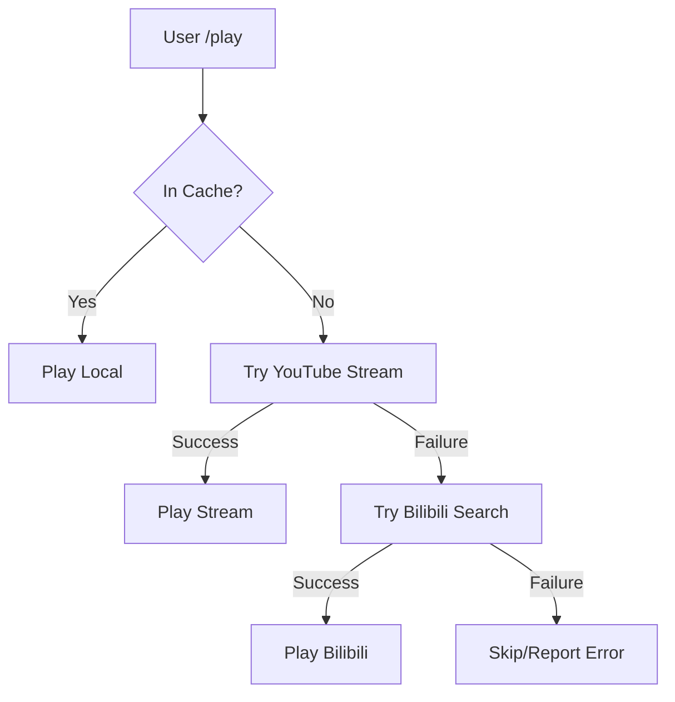

# 🎵 Discord Music Bot

A feature-rich, robust, and open-source Discord music bot built with Python, `discord.py`, and `yt-dlp`.

> **[中文文档 (Chinese Documentation)](README_CN.md)**

## 🚀 v2.1 Release: Enhanced Reliability & Multi-Source Fallback

**This release further improves playback stability against YouTube's aggressive bot detection.**

### 🆕 What's New:
1.  **Multi-Source Fallback (YouTube ➔ Bilibili)**:
    *   If a YouTube video is strictly geo-blocked or restricted (returning 403 or "Format not available"), the bot **automatically** searches for the same song on **Bilibili**.
    *   This ensures continuous music even when YouTube's primary streams are unreachable.
2.  **Adaptive Format Selection**:
    *   Switched to `bestaudio/best` with a more permissive extraction logic. The bot now intelligently falls back from pure audio streams to video-audio muxed streams if the server IP is throttled.
3.  **Robust Error Handling**:
    *   Enhanced `YTDLSource` to handle cases where YouTube hides the direct playback URL. It now scans all available `formats` to find a working link.

---

## ✨ Key Features

*   **🎶 High Quality Playback**: Streams/Downloads audio from YouTube, Bilibili, SoundCloud, and direct URLs.
*   **🛡️ Throttling Protection**: Multi-layer defense (Header Injection, Cookie Support, Adaptive Format Switching).
*   **🔄 Automatic Fallback**: Seamless transition to Bilibili if YouTube extraction fails.
*   **🟢 Spotify Support**: Seamlessly handles Spotify Track, Album, and Playlist links (auto-converts to YouTube/Bilibili queries).
*   **🤖 Slash Commands**: Full support for `/play`, `/search` with rich autocomplete suggestions.
*   **📂 Playlist Management**: Create, save, and load custom playlists. Supports importing from YouTube/Spotify playlists.

## 🛠️ Installation & Setup

### 1. Prerequisites

*   **Python 3.10+**
*   **FFmpeg**: Essential for audio processing.
*   **Node.js**: Required for `yt-dlp` signature decryption (Decentralized EJS support).
*   **Conda**: Recommended for environment management.

### 2. Installation

1.  **Clone & Setup Environment:**
    ```bash
    git clone <repository_url>
    cd discord_song_bot
    conda env create -f environment.yml
    conda activate discord_music_bot
    ```

2.  **Configuration (.env):**
    Create a `.env` file in the project root with your `DISCORD_TOKEN`, `SPOTIPY_CLIENT_ID`, and `SPOTIPY_CLIENT_SECRET`.

3.  **Cookies (Crucial):**
    Place your exported YouTube `cookies.txt` in the project **root directory** to bypass restrictions.

## 📁 Project Structure

```text
.
├── cogs/
│   └── music.py          # Core music logic, YTDLSource, and Fallback system
├── data/
│   ├── music_cache/      # Local storage for downloaded songs
│   └── playlists/        # Persistent user playlists (JSON)
├── scripts/
│   └── daily_cleanup.sh  # Cache maintenance script
├── .github/workflows/    # CI/CD (Auto-deploy to server)
├── cookies.txt           # YouTube cookies for bypass
├── main.py               # Bot entry point & command syncing
└── environment.yml       # Conda environment definition
```

## 🎮 Commands

| Command | Description |
| :--- | :--- |
| **`/play <query>`** | Play a song via URL or search term. |
| **`/search <query>`** | Search and select from results. |
| **`/stop`** | Stop playback and clear queue. |
| **`/skip`** | Skip current song (triggers fallback if error occurs). |
| **`/queue`** | Display play queue. |
| **`/playlist`** | Manage saved playlists. |

---

## 🏗️ Technical Workflow


