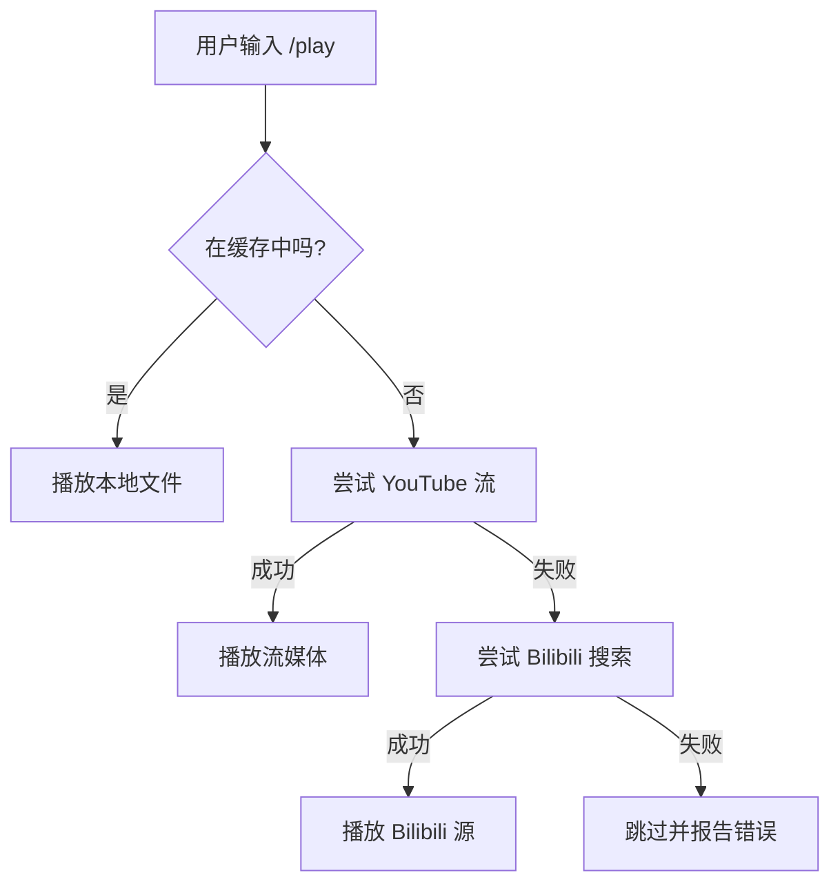

# 🎵 Discord Music Bot (CN) / 音乐机器人

一款基于 Python, `discord.py` 和 `yt-dlp` 构建的功能强大、稳定可靠的 Discord 音乐机器人。

> **[Go to English Documentation (英文文档)](README.md)**

## 🚀 v2.1 重大更新：增强稳定性与多源回退机制

**此版本针对 YouTube 激进的反爬虫策略进行了深度优化。**

### 🆕 更新亮点：
1.  **多源自动回退 (YouTube ➔ Bilibili)**：
    *   当 YouTube 视频因地理限制或 IP 封锁（返回 403 或“格式不可用”）无法播放时，机器人会**自动**在 **Bilibili** 上搜索同名歌曲。
    *   这确保了即使 YouTube 主源失效，音乐播放也不会中断。
2.  **自适应格式选择**：
    *   切换为 `bestaudio/best` 并优化了提取逻辑。当服务器 IP 受到频率限制时，机器人会智能地从纯音频流切换到带音频的视频流，最大化播放成功率。
3.  **鲁棒的 URL 提取**：
    *   加固了 `YTDLSource` 逻辑。即使 YouTube 隐藏了顶层播放地址，机器人也能自动扫描所有可用格式 (`formats`) 来提取有效链接。

---

## ✨ 核心功能特性

*   **🎶 高品质播放**: 支持 YouTube, Bilibili, SoundCloud 和直链音频源。
*   **🛡️ 防封锁保护**: 内置多层防御（HTTP 头注入、Cookie 支持、自适应格式切换）。
*   **🔄 自动回退**: YouTube 提取失败时无缝切换至 Bilibili。
*   **🟢 Spotify 支持**: 完美支持 Spotify 单曲、专辑和歌单链接（自动转换为 YouTube/Bilibili 搜索源）。
*   **🤖 斜杠命令 (Slash Commands)**: 全面支持 `/play`, `/search` 等命令，并带有丝滑的自动补全建议。
*   **📂 歌单管理**: 支持创建、保存、加载自定义歌单，甚至支持直接导入 YouTube 播放列表或 Spotify 歌单。

## 🛠️ 安装与部署

### 1. 前置要求

*   **Python 3.10+**
*   **FFmpeg**: 音频处理的核心组件。
*   **Node.js**: 用于解密 YouTube 签名（支持分布式 EJS）。
*   **Conda**: 推荐用于环境管理。

### 2. 安装步骤

1.  **克隆代码并创建环境:**
    ```bash
    git clone <repository_url>
    cd discord_song_bot
    conda env create -f environment.yml
    conda activate discord_music_bot
    ```

2.  **配置文件 (.env):**
    在项目根目录创建 `.env` 文件，配置 `DISCORD_TOKEN`, `SPOTIPY_CLIENT_ID` 和 `SPOTIPY_CLIENT_SECRET`。

3.  **Cookies 配置 (关键):**
    将导出的 `cookies.txt` 放置在项目**根目录**下，用于绕过 YouTube 的访问限制。

## 📁 项目结构

```text
.
├── cogs/
│   └── music.py          # 核心音乐逻辑、YTDLSource 以及回退系统
├── data/
│   ├── music_cache/      # 下载歌曲的本地缓存
│   └── playlists/        # 用户保存的歌单 (JSON)
├── scripts/
│   └── daily_cleanup.sh  # 缓存自动清理脚本
├── .github/workflows/    # CI/CD (自动部署到服务器)
├── cookies.txt           # YouTube Cookie 文件
├── main.py               # 机器人入口与命令同步
└── environment.yml       # Conda 环境定义
```

## 🎮 常用命令

| 命令 | 描述 |
| :--- | :--- |
| **`/play <链接或歌名>`** | 播放歌曲。支持 URL 或关键词搜索。 |
| **`/search <关键词>`** | 搜索并从结果中选择。 |
| **`/stop`** | 停止播放并清空队列。 |
| **`/skip`** | 跳过当前歌曲（若出错将触发自动回退）。 |
| **`/queue`** | 显示当前播放队列。 |
| **`/playlist`** | 管理自定义歌单。 |

---

## 🏗️ 架构工作流 (Technical Workflow)


